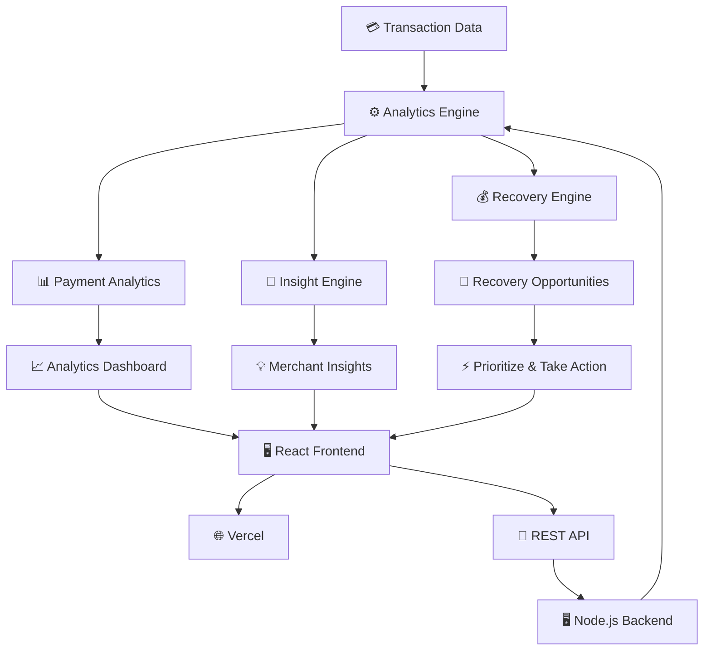
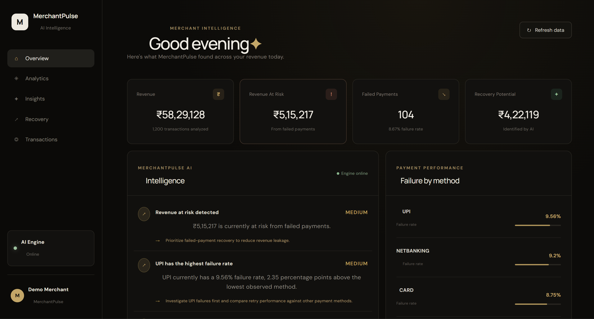
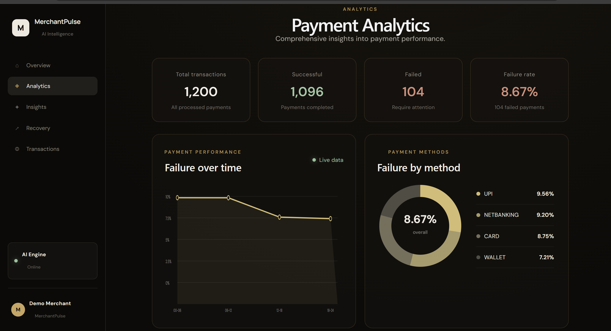
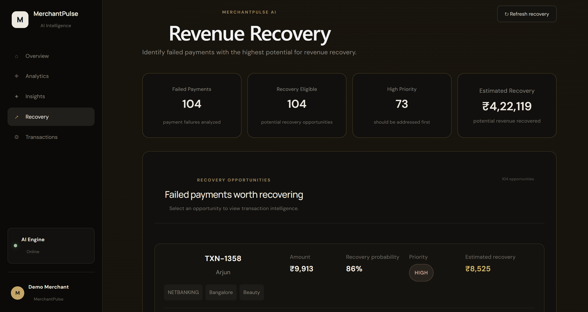
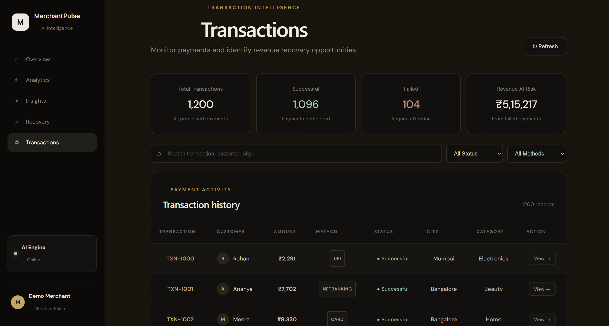

# MerchantPulse AI

### AI-Powered Payment Intelligence & Revenue Recovery Platform

MerchantPulse AI is a payment intelligence platform designed to help merchants understand payment failures, identify revenue at risk, and prioritize the failed transactions with the highest recovery potential.

The platform transforms raw transaction data into actionable insights through analytics, payment failure analysis, recovery scoring, and prioritized recovery opportunities.

---

## 🚀 Live Demo

🌐 **Application:**  
https://merchantpulse-ai-flame.vercel.app

🔗 **GitHub:**  
https://github.com/sathwiko7/merchantpulse-ai

---

## 🎯 What Problem Does It Solve?

Failed payments can represent significant lost revenue for businesses.

MerchantPulse AI helps merchants answer:

- Which payments are failing?
- How much revenue is currently at risk?
- Which payment methods have the highest failure rates?
- Which failed payments have the highest recovery potential?
- Which recovery opportunities should be addressed first?
- What actions can merchants take to recover lost revenue?

---

## ✨ Key Features

### 📊 Payment Analytics

Provides an overview of payment performance including:

- Total transactions
- Successful payments
- Failed payments
- Failure rate
- Revenue at risk
- Failure trends over time
- Payment method performance

### 🧠 Merchant Intelligence

The intelligence layer analyzes transaction data and generates actionable insights such as:

- Revenue at risk detection
- Payment method failure analysis
- High-risk payment patterns
- Recovery opportunities
- Recommended priorities

### 💰 Revenue Recovery

Identifies failed transactions that may be worth recovering.

Each recovery opportunity includes:

- Transaction ID
- Customer
- Transaction amount
- Recovery probability
- Recovery priority
- Estimated recovery amount
- Payment method
- Location
- Category

### 💳 Transaction Intelligence

Merchants can explore transaction history and filter transactions by:

- Status
- Payment method
- Customer
- City
- Transaction details

---

# 🏗️ Architecture



### Architecture Flow

```text
Transaction Data
       │
       ▼
Analytics Engine
       │
       ├──────────────► Payment Analytics
       │                       │
       │                       ▼
       │                Analytics Dashboard
       │
       ├──────────────► Insight Engine
       │                       │
       │                       ▼
       │                 Merchant Insights
       │
       └──────────────► Recovery Engine
                               │
                               ▼
                     Recovery Opportunities
                               │
                               ▼
                       Prioritize & Act
```


## 🛠️ Tech Stack

### Frontend

- React
- Vite
- JavaScript
- CSS

### Backend

- Node.js
- REST API

### Deployment

- Vercel — Frontend
- Render — Backend
- GitHub — Source Control


---

## 📸 Application Screenshots

### 🏠 Overview Dashboard



### 📊 Payment Analytics



### 💰 Revenue Recovery



### 💳 Transaction Intelligence



---

## 🧠 Intelligence & Recovery Scoring

MerchantPulse uses an explainable decision engine to transform transaction analytics into actionable merchant intelligence.

### Recovery Scoring

Each failed transaction is evaluated using multiple observable signals:

- Transaction value
- Payment-method failure behaviour
- Time-window failure behaviour
- Overall merchant failure rate
- Detected payment anomalies

A failed transaction starts with a baseline recovery probability and receives additional score adjustments based on these factors.

The final recovery probability is constrained to a safe range and used to determine the recovery priority.

### Recovery Priority

Recovery opportunities are classified into:

- 🔴 HIGH — high-value or high-probability recovery opportunities
- 🟡 MEDIUM — moderate recovery opportunities
- 🟢 LOW — lower-value and lower-probability opportunities

### Estimated Recovery

Estimated recovery is calculated using:

`Estimated Recovery = Transaction Amount × Recovery Probability`

### Explainable Insights

The MerchantPulse Intelligence Engine analyzes:

- Revenue at risk
- Payment-method failure patterns
- Time-based failure patterns
- Overall failure rate
- Payment anomalies

Each generated insight contains:

- Severity
- Confidence
- Evidence
- Recommendation
- Recommended action

This makes every recommendation traceable to observed transaction behaviour rather than producing unexplained predictions.

### Recommended Actions

The system can recommend payment-specific recovery actions such as:

- Retry UPI payment
- Retry card payment
- Retry wallet payment
- Retry payment or suggest an alternative payment method

For high-priority NetBanking failures, the system can recommend trying another payment method such as UPI or card.


---

## 📁 Project Structure

```text
merchantpulse-ai/
│
├── backend/
│   ├── data/
│   │   ├── generateData.js
│   │   └── transactions.json
│   │
│   ├── services/
│   │   ├── analyticsEngine.js
│   │   ├── insightEngine.js
│   │   └── recoveryEngine.js
│   │
│   ├── api.js
│   └── package.json
│
├── frontend/
│   ├── src/
│   │   ├── Analytics.jsx
│   │   ├── Insights.jsx
│   │   ├── Recovery.jsx
│   │   ├── Transactions.jsx
│   │   ├── App.jsx
│   │   ├── App.css
│   │   └── main.jsx
│   │
│   ├── public/
│   └── package.json
│
├── screenshots/
│   ├── analytics.png
│   ├── overview.png
│   ├── revenue-recover.png
│   └── transactions.png
│
├── README.md
└── .gitignore


---

## ⚙️ How It Works

MerchantPulse AI processes transaction data through three intelligence engines:

1. **Transaction Data** — Raw payment transactions are loaded from the dataset.
2. **Analytics Engine** — Calculates payment metrics, failure rates, trends, and revenue at risk.
3. **Insight Engine** — Identifies payment patterns and generates explainable merchant insights.
4. **Recovery Engine** — Scores failed transactions based on recovery potential and priority.
5. **React Dashboard** — Presents analytics, insights, transactions, and recovery opportunities to the merchant.

---

## 🚀 Deployment

| Component | Platform |
|---|---|
| Frontend | Vercel |
| Backend | Render |
| Source Code | GitHub |

### Live Application

[MerchantPulse AI](https://merchantpulse-ai-flame.vercel.app)

### Backend API

[MerchantPulse API](https://merchantpulse-ai.onrender.com)

---

## 📁 Project Structure

```text
merchantpulse-ai/
├── backend/
│   ├── data/
│   │   ├── generateData.js
│   │   └── transactions.json
│   ├── services/
│   │   ├── analyticsEngine.js
│   │   ├── insightEngine.js
│   │   └── recoveryEngine.js
│   ├── api.js
│   └── package.json
│
├── frontend/
│   ├── src/
│   │   ├── Analytics.jsx
│   │   ├── Insights.jsx
│   │   ├── Recovery.jsx
│   │   ├── Transactions.jsx
│   │   ├── App.jsx
│   │   └── main.jsx
│   └── package.json
│
├── screenshots/
│   ├── analytics.png
│   ├── overview.png
│   ├── revenue-recover.png
│   └── transactions.png
│
└── README.md