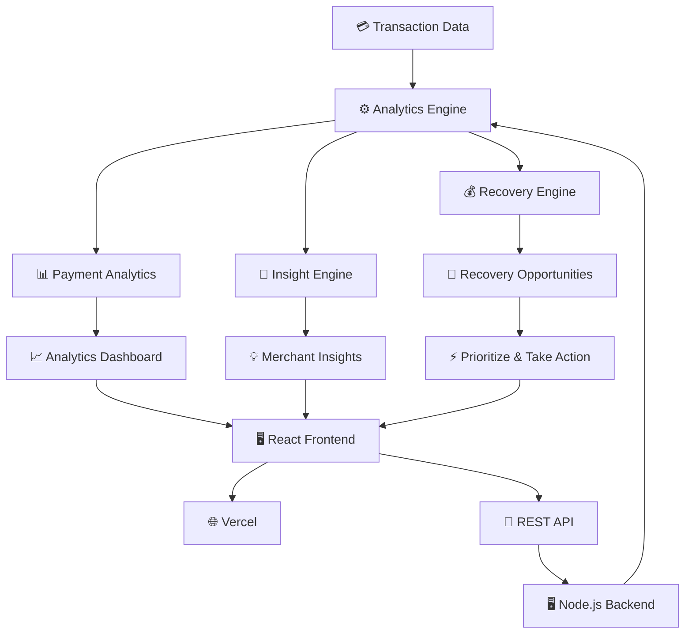

# MerchantPulse AI

### AI-Powered Payment Intelligence & Revenue Recovery Platform

MerchantPulse AI is a payment intelligence platform designed to help merchants understand payment failures, identify revenue at risk, and prioritize the failed transactions with the highest recovery potential.

The platform transforms raw transaction data into actionable insights through analytics, payment failure analysis, recovery scoring, and prioritized recovery opportunities.

---

## 🚀 Live Demo

🌐 **Application:**  
https://merchantpulse-ai-flame.vercel.app

🔗 **GitHub:**  
https://github.com/sathwiko7/merchantpulse-ai

---

## 🎯 What Problem Does It Solve?

Failed payments can represent significant lost revenue for businesses.

MerchantPulse AI helps merchants answer:

- Which payments are failing?
- How much revenue is currently at risk?
- Which payment methods have the highest failure rates?
- Which failed payments have the highest recovery potential?
- Which recovery opportunities should be addressed first?
- What actions can merchants take to recover lost revenue?

---

## ✨ Key Features

### 📊 Payment Analytics

Provides an overview of payment performance including:

- Total transactions
- Successful payments
- Failed payments
- Failure rate
- Revenue at risk
- Failure trends over time
- Payment method performance

### 🧠 Merchant Intelligence

The intelligence layer analyzes transaction data and generates actionable insights such as:

- Revenue at risk detection
- Payment method failure analysis
- High-risk payment patterns
- Recovery opportunities
- Recommended priorities

### 💰 Revenue Recovery

Identifies failed transactions that may be worth recovering.

Each recovery opportunity includes:

- Transaction ID
- Customer
- Transaction amount
- Recovery probability
- Recovery priority
- Estimated recovery amount
- Payment method
- Location
- Category

### 💳 Transaction Intelligence

Merchants can explore transaction history and filter transactions by:

- Status
- Payment method
- Customer
- City
- Transaction details

---

# 🏗️ Architecture



### Architecture Flow

```text
Transaction Data
       │
       ▼
Analytics Engine
       │
       ├──────────────► Payment Analytics
       │                       │
       │                       ▼
       │                Analytics Dashboard
       │
       ├──────────────► Insight Engine
       │                       │
       │                       ▼
       │                 Merchant Insights
       │
       └──────────────► Recovery Engine
                               │
                               ▼
                     Recovery Opportunities
                               │
                               ▼
                       Prioritize & Act
```


## 🛠️ Tech Stack

### Frontend

- React
- Vite
- JavaScript
- CSS

### Backend

- Node.js
- REST API

### Deployment

- Vercel — Frontend
- Render — Backend
- GitHub — Source Control